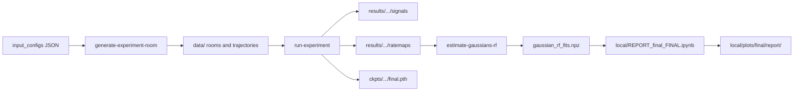

# Place Cells Episodic RNN — Spatial BTSP Optimization

In this repository, we study **Behavioral Timescale Synaptic Plasticity (BTSP)** in artificial neural networks: whether plateau-like, one-shot representational changes can emerge from standard backpropagation training, and how the choice of optimizer shapes that behavior. We use it to **train** recurrent place-cell models, **record** optimizer and gradient signals during learning, and **analyze** spatial representations over training.

We implement the **spatial context** as a leaky RNN trained to predictively autoencode weakly spatially modulated (WSM) sensory input as an agent explores square rooms along trajectories — the hippocampal navigation setup adapted from Wang et al. (NeurIPS 2024). We built this repository iterating on top of Wang et al.'s work (see [References](#references)).

---

## Setup

We manage dependencies with [uv](https://docs.astral.sh/uv/) and Python ≥ 3.12. From the repo root:

```bash
uv sync

# optional convenience wrapper (runs uv sync and prints torch version)
./setup.sh
```

On Linux, `uv sync` installs PyTorch with CUDA support via the configured uv index.

Throughout this README, we invoke commands as `uv run <command>` — entry points are declared in `pyproject.toml` under `[project.scripts]`.

---

## Project layout

We resolve repository paths from [`src/core/paths.py`](src/core/paths.py): `data/`, `results/`, `ckpts/`, and `plots/` at the repo root.

```
place_cells_episodic_rnn/
├── input_configs/          # JSON experiment configs (single_room, two_rooms, many_rooms, …)
├── scripts/                # CLI entry points (run-experiment, generate-experiment-room, …)
├── src/
│   ├── core/               # Training loop, TBPTT, gradient capture, warmup, plateau/alt training
│   ├── experiments/
│   │   ├── common/         # Shared paths, signals/ratemaps I/O, config loading
│   │   ├── single_room/    # One-room protocol (thesis “(single)”)
│   │   ├── two_rooms/      # Two biased rooms, alternating visits (thesis “(two rooms)”)
│   │   ├── many_rooms/     # 20-room shuffled cycles (extended; not primary workflow)
│   │   └── old_cycles/     # Original Wang et al. 20×30 baseline reproduction
│   ├── optimizers/         # Per-optimizer signal extractors (SGD, Adam, AdaGrad, Shampoo×2)
│   ├── analysis/           # Gaussian PF fitting, cell/PF evolution, plotting helpers
│   ├── trajectories/       # Room + trajectory generation
│   └── models/nn4n/        # Vendored leaky RNN (import as nn4n)
├── data/                   # GENERATED — rooms, WSM maps, trajectories (gitignored)
│   ├── single_room/
│   ├── two_rooms/
│   └── many_rooms/
├── results/                # GENERATED — signals, ratemaps, Gaussian fits, config.json (gitignored)
├── ckpts/                  # GENERATED — model checkpoints per optimizer run (gitignored)
├── plots/                  # GENERATED — experiment-level plots from src/analysis (gitignored)
├── results_multiseed/      # JSON summaries from multi-seed / training-mode comparisons
├── local/                  # GITIGNORED — thesis analysis notebooks & figure pipeline (not in git)
│   ├── REPORT_final_FINAL.ipynb   # Curated thesis figures (main report plots)
│   ├── report_final/              # Plot helpers imported by the report notebook
│   ├── single_room_multi_opt.ipynb
│   ├── two_rooms_multiopt.ipynb
│   └── plots/final/report/        # PDF/CSV outputs from REPORT_final_FINAL.ipynb
└── imgs/                   # Static README / paper figures
```

### Where outputs are written

After training, we write each optimizer run under:

```
results/<experiment_type>[<_altTOO|_plateau>]/   # alt variants with --alt-training / --plateau
  <suffix>/
    <optimizer_tag>/                            # e.g. adam_0.000781
      config.json
      signals/                                  # per-segment NPZ files
      ratemaps/                                 # batched fp16 ratemap NPZ per trajectory
      gaussian_rf_fits.npz                      # after estimate-gaussians-rf
      gaussian_rf_fits_room0.npz / room1.npz    # two_rooms only
```

Checkpoints follow the same suffix/optimizer layout under `ckpts/<experiment_type>/`.

Default config suffixes:

| Experiment | Default suffix |
|---|---|
| `single_room` | `600s_warm15x60s_train10x10s_ep1` |
| `two_rooms` | `300s_warm16x60s_perroom10x20s_rep4` |

---

## Model

We train a recurrent autoencoder (RAE) built on the vendored [NN4Neurosim](https://github.com/NN4Neurosim/nn4n) leaky RNN ([`src/models/nn4n/`](src/models/nn4n/)):

- **Input:** masked WSM vector (200 sensory cells; each room has a unique spatially smoothed response map).
- **Recurrent core:** leaky integration (α ≈ 0.1275), ReLU firing rate, 1000 hidden units.
- **Readout:** linear decode predicting stimuli at *t* + 1.
- **Training:** truncated BPTT in fixed-length segments; we carry hidden state *within* a segment but reset it *between* segments.
- **Loss:** λ_MSE · MSE + λ_FR · mean firing rate² (we tuned these hyperparameters via Bayesian optimization; see configs).

We explored learnable activation variants (sigmoid, LSF, SAB) through `bayesian-opt-hyperparam`, but our thesis experiments use ReLU.

---

## End-to-end workflows

### Protocol overview

| | `single_room` | `two_rooms` |
|---|---|---|
| Trajectory length | 600 s | 300 s |
| TBPTT segment (main) | 10 s | 20 s |
| Warmup | 15 traj × 60 s segments, Gaussian-smoothed WSM (σ = 15 cm) | 16 traj pooled (8/room), same warmup |
| Main training | 10 trajectories × 1 epoch | 10 traj/room, 4 repetitions; room 0 biased top-left, room 1 bottom-right |
| Ratemap eval | 128 × 350 s held-out trajectories | Same, evaluated on **both** rooms every segment |

We configure the main protocols in [`input_configs/single_room.json`](input_configs/single_room.json) and [`input_configs/two_rooms.json`](input_configs/two_rooms.json). For a quick sanity check, we use [`input_configs/single_room_smoke.json`](input_configs/single_room_smoke.json).

### 1. Generate room data

```bash
uv run generate-experiment-room --config input_configs/single_room.json
uv run generate-experiment-room --config input_configs/two_rooms.json
```

This writes to `data/<experiment_type>/`: `manifest.json`, per-room `arena_map.npz`, `traj.npz`, WSM response maps, and held-out evaluation trajectories.

### 2. Train (all optimizers)

```bash
uv run run-experiment --config input_configs/single_room.json
uv run run-experiment --config input_configs/two_rooms.json
```

With `"optimizers": "all"` in the config, we run all five optimizers sequentially (SGD, AdaGrad, Adam, Pure Shampoo, Grafted Shampoo) using fixed learning rates from [`src/optimizers/defaults.py`](src/optimizers/defaults.py). We skip runs that already finished (`ckpts/.../final.pth` exists).

Optional training modes:

```bash
# On-optimizer gradient scaling (results under results/<experiment>_altTOO/)
uv run run-experiment --config input_configs/single_room.json --alt-training

# BTSP-style plateau training (results under results/<experiment>_plateau/)
uv run run-experiment --config input_configs/single_room.json --plateau
```

### 3. Fit place-field Gaussians

We run this before PF-based analysis and the report notebook:

```bash
uv run estimate-gaussians-rf --input results/single_room/600s_warm15x60s_train10x10s_ep1
uv run estimate-gaussians-rf --input results/two_rooms/300s_warm16x60s_perroom10x20s_rep4
```

This fits a 2-component Gaussian sum to each neuron's ratemap at every capture timepoint and writes `gaussian_rf_fits.npz` (or per-room files for `two_rooms`) into each optimizer directory.

### 4. Generate thesis figures

Open and run all cells in [`local/REPORT_final_FINAL.ipynb`](local/REPORT_final_FINAL.ipynb).

**Prerequisites:** trained runs and Gaussian RF fits under `results/single_room/` and `results/two_rooms/`.

**Outputs:** `local/plots/final/report/*.pdf` and companion CSVs. For deeper exploration, we also use `local/single_room_multi_opt.ipynb` and `local/two_rooms_multiopt.ipynb` (plot helpers in `local/report_final/`).



### Other experiments

- **`many_rooms`:** 20 unbiased rooms visited in shuffled cycles ([`input_configs/many_rooms.json`](input_configs/many_rooms.json)). Same generate → train → estimate-gaussians-rf pattern; not our primary thesis workflow.
- **Hyperparameter search:** `uv run bayesian-opt-hyperparam --config input_configs/single_room.json --variant a --n-trials 30` tunes λ_MSE, λ_FR, mask rate, and α; `--lr-only` finetunes per-optimizer learning rates.
- **Wang et al. baseline:** `uv run generate-oldcycles-rooms` then `uv run old-cycles-experiment` reproduces the original 20-room × 30-cycle protocol ([`input_configs/all_cycles.json`](input_configs/all_cycles.json)).

---

## Captured data and timing

During training, we log data at two cadences: **every TBPTT segment** (optimizer step) and **every ratemap capture** (eval pass on held-out trajectories).

### Per-segment signals (after each optimizer step)

We save these to `results/.../signals/<traj_dir>/segment_<N>.npz`:

| Field | Description |
|---|---|
| `loss` | Combined MSE + firing-rate regularization for the segment |
| `g_bptt_mse` | `(1, T, H)` — full backprop-through-time credit to hidden states |
| `g_local_mse` | `(1, T, H)` — direct readout-only credit (instantaneous, no recurrent future path) |
| `g_fr` | `(H,)` — firing-rate regularizer gradient |
| `opt_signals` | Optimizer-internal state (accumulators, second moments, Shampoo factors) used to compute **effective learning rates** per weight or per neuron depending on the optimizer |
| `weight__*` | Post-step snapshots of recurrent, input, and readout weights — enables **ΔW** analysis between consecutive segments |
| `h_inv__*` | Shampoo inverse Kronecker factors (Pure / Grafted Shampoo only) |
| `on_opt_scale_factors` | `(H,)` per-hidden-unit gradient multipliers when using `--alt-training` |
| `plateau_units` / `plateau_damping` | Units and damping factors when using `--plateau` training |

We derive effective learning rates from `opt_signals` as documented in [`src/experiments/common/signals_io.py`](src/experiments/common/signals_io.py): constant γ for SGD; per-weight γ/√S for AdaGrad; γ/(√V̂ + ε) for Adam; stored `h_inv_norm` for Pure Shampoo; AdaGrad grafting LR for Grafted Shampoo.

Trajectory directory naming:

- **`single_room`:** `epoch<N>_traj<M>/segment_<K>.npz`
- **`two_rooms`:** `rep<N>_room<R>_traj<M>/segment_<K>.npz`

We do not write warmup segments to `signals/` — only main-training segments are captured.

### Spatial ratemaps

We save these to `results/.../ratemaps/` as fp16 NPZ files batched per trajectory (`ratemaps` array + `capture_tags`).

| When | What |
|---|---|
| Before each training trajectory | `pre` capture — baseline activity map for that trajectory |
| After every training segment (default: every segment) | `seg<N>` capture — activity after the optimizer step |

We compute ratemaps by running the model on **128 held-out evaluation trajectories** (350 s each) that never appear in training. For `two_rooms`, we evaluate on both the currently visited room (`train_same`) and the other room (`train_other`) at each capture.

### Checkpoints and metadata

| Location | Contents |
|---|---|
| `ckpts/.../<optimizer_tag>/` | `{group_tag}.pth` at protocol group boundaries; `final.pth` at end |
| `results/.../config.json` | Full hyperparameters, optimizer config, timestamps, alt/plateau settings |

For downstream analysis, we use the loaders in [`src/experiments/common/signals_io.py`](src/experiments/common/signals_io.py) for loss, gradients, effective learning rates, and ΔW timelines; [`src/analysis/`](src/analysis/) implements Gaussian PF fitting, place-field birth/death tracking, and bioplausibility metrics used in our report notebooks.

---

## Related projects

- [NN4Neurosim](https://github.com/NN4Neurosim/nn4n) — leaky RNN implementation, vendored under `src/models/nn4n/`
- [Wang et al. project page](https://zhaozewang.github.io/tms/) — original place-field emergence work

---

## References

Wang et al. (NeurIPS 2024):

```
@inproceedings{
  wang2024time,
  title={Time Makes Space: Emergence of Place Fields in Networks Encoding Temporally Continuous Sensory Experiences},
  author={Zhaoze Wang and Ronald W. Di. Tullio and Spencer Rooke and Vijay Balasubramanian},
  booktitle={Proceedings of the 2024 Conference on Neural Information Processing Systems (NeurIPS)},
  year={2024}
}
```
